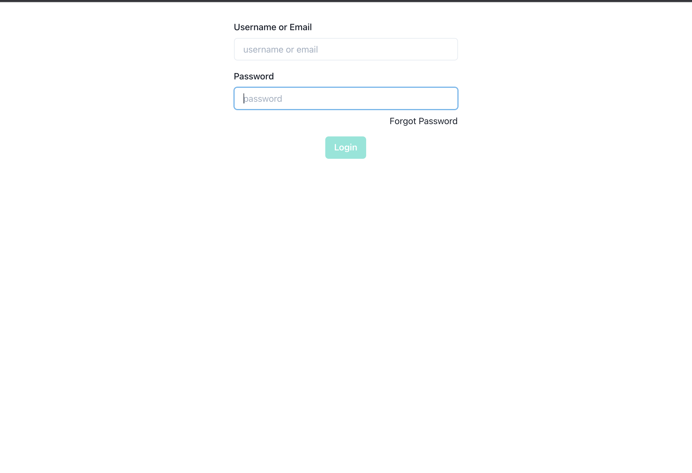

# ChatApp
•	This project is a web app like reddit achieving user authentication and CRUD operation for posts.
•	The purpose of this project is to get familar with using typescript for development and graphQL server.

## Table of contents
* [General info](#General-info)
* [Technologies](#Technologies)
* [Setup](#Setup)


## General-info
1. Posts List.
<p align="center">

<p>
2. User Login.
<p align="center">

<p>
3. Register User.
<p align="center">

<p>
4. Forget Password.
<p align="center">

<p>
5. Create Post.
<p align="center">

<p>
6. Edit Post.
<p align="center">

<p>
7. Post Detail.
<p align="center">

<p>


## Technologies
Project is created with:
* React
* Next.js
* Apollo GraphQL server
* PostgreSQL(TypeORM)
* VPS(digitalocean)

## Setup
#### Frontend 
```bash
npm install
npm run dev
```
#### Backend 
```bash
npm run dev
```